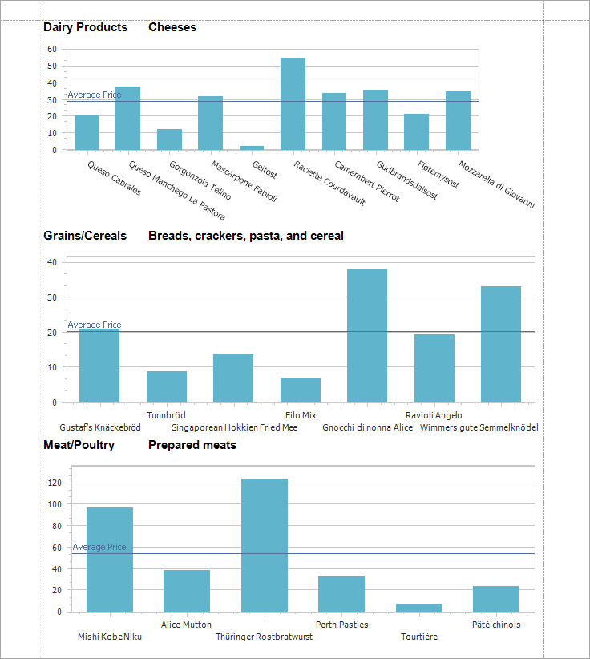
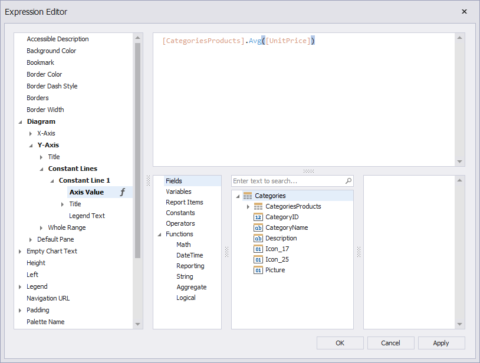

<!-- default badges list -->

[](https://docs.devexpress.com/GeneralInformation/403183)
<!-- default badges end -->

# Reporting for WinForms - Use Binding Expressions to Highlight Average Sales in Charts

The following example shows how to display a constant line that shows average sales of products.



In this example, the constant line is bound to the following expression:

```expression
[CategoriesProducts].Avg([UnitPrice])
```



## Documentation

* [Bind Report Controls to Data with Binding Expressions](https://docs.devexpress.com/XtraReports/1180/detailed-guide-to-devexpress-reporting/use-report-controls/bind-report-controls-to-data/specify-a-control-s-binding-expression?v=23.1)
